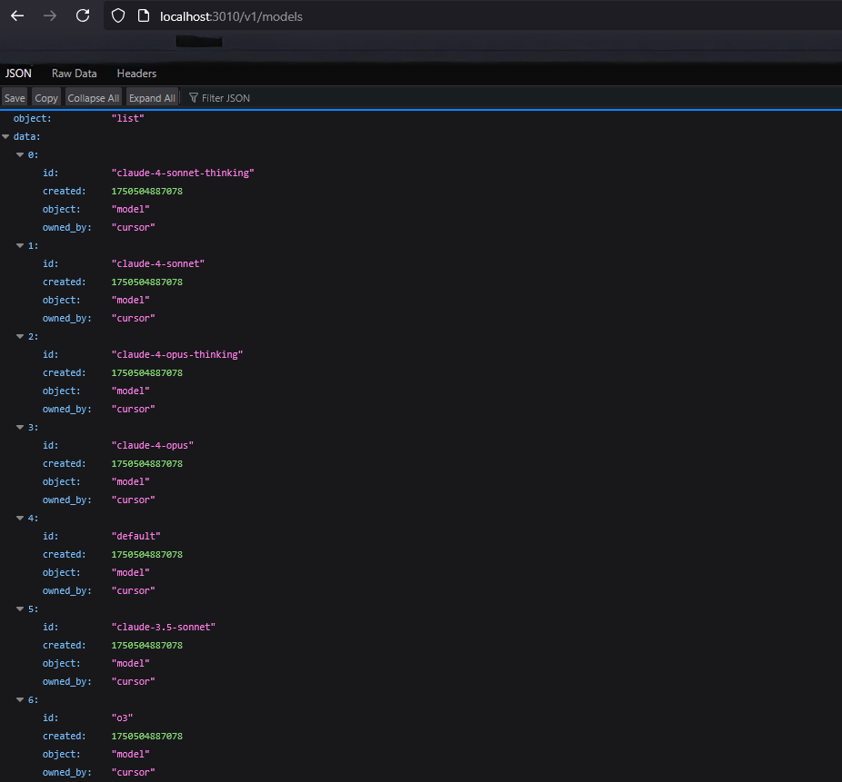

# Cursor To OpenAI

Convert the Cursor Editor to an OpenAI API interface service.

## Introduction

This project provides a proxy service that converts the AI chat of the Cursor Editor into an OpenAPI API, allowing you to reuse the LLM of the Cursor in other applications.

## Prerequisites

Visit [Cursor](https://www.cursor.com) and register a account.

## 🚀 Quick Start

### 1. Get Your Cursor Token (Automatic - Recommended)

```bash
# Install dependencies
npm install

# Get your token automatically
npm run login
```

This will:

- ✅ Open a browser login page
- ✅ Automatically save token to `.env` file
- ✅ No manual copy-paste required

### 2. Start the Server

Choose your preferred method:

```bash
# Option 1: Simple start
npm start

# Option 2: With startup script (Linux/Mac)
npm run start:script

# Option 3: With startup script (Windows)
npm run start:windows
```

### 3. Test the API

```bash
curl http://localhost:3010/v1/models
```



## 📋 Deployment Options

### 🖥️ Local Development

```bash
npm install
npm run login        # Get token
npm start           # Start server
```

### 🐳 Docker Deployment

#### Quick Docker Run

```bash
# Linux/Mac
npm run docker:run

# Windows
npm run docker:run:windows
```

#### Manual Docker Commands

```bash
# Build image
docker build -t cursor-to-openai .

# Run with .env file
docker run -d --name cursor-to-openai -p 3010:3010 -v $(pwd)/.env:/app/.env cursor-to-openai
```

### 🔧 System Service Installation

#### Linux (systemd)

```bash
# Install as system service
sudo npm run service:install

# Service management
sudo systemctl start cursor-to-openai
sudo systemctl stop cursor-to-openai
sudo systemctl status cursor-to-openai

# View logs
sudo journalctl -u cursor-to-openai -f

# Uninstall
sudo npm run service:uninstall
```

#### Windows (NSSM)

```powershell
# Install as Windows service (Run as Administrator)
npm run service:install:windows

# Service management
net start CursorToOpenAI
net stop CursorToOpenAI
Get-Service CursorToOpenAI

# View logs
Get-Content logs\service.log -Tail 50 -Wait

# Uninstall
npm run service:uninstall:windows
```

## 🔑 Authentication Methods

### Method 1: Automatic Login (Recommended)

1. Run `npm run login`
2. Open the URL shown in the terminal
3. Login with your Cursor account
4. Token is automatically saved to `.env` file

**Example output:**

```bash
[Log] Please open the following URL in your browser to login:
https://www.cursor.com/loginDeepControl?challenge=...
[Log] Waiting for login... (1/60)
[Log] Login successfully. Your Cursor cookie:
user_01JJF<...>
[Log] Added CURSOR_TOKEN to .env file
```

### Method 2: API-based Login

For advanced users who want to automate the process:

```python
import requests

WorkosCursorSessionToken = "your_session_token_from_browser"
response = requests.get("http://localhost:3010/cursor/loginDeepControl", headers={
    "authorization": f"Bearer {WorkosCursorSessionToken}"
})
data = response.json()
cursor_token = data["accessToken"]
```

## 📚 API Usage

### Get Available Models

```bash
curl -H "Authorization: Bearer YOUR_CURSOR_TOKEN" \
     http://localhost:3010/v1/models
```

### Chat Completions

```bash
curl -X POST http://localhost:3010/v1/chat/completions \
  -H "Content-Type: application/json" \
  -H "Authorization: Bearer YOUR_CURSOR_TOKEN" \
  -d '{
    "model": "claude-3-7-sonnet",
    "messages": [{"role": "user", "content": "Hello!"}]
  }'
```

### Python Example

```python
from openai import OpenAI

client = OpenAI(
    api_key="YOUR_CURSOR_TOKEN",
    base_url="http://localhost:3010/v1"
)

response = client.chat.completions.create(
    model="claude-3-7-sonnet",
    messages=[{"role": "user", "content": "Hello!"}],
    stream=False
)

print(response.choices[0].message.content)
```

## 🛠️ Available Scripts

### Core Scripts

```bash
npm run login                    # Get Cursor token
npm start                       # Start development server
npm run dev                     # Same as start
```

### Startup Scripts

```bash
npm run start:script            # Linux/Mac startup script
npm run start:windows           # Windows startup script
```

### Docker Scripts

```bash
# Linux/Mac
npm run docker:build            # Build Docker image
npm run docker:run              # Build and run container
npm run docker:stop             # Stop container
npm run docker:logs             # View container logs
npm run docker:status           # Show container status
npm run docker:cleanup          # Clean up containers and images

# Windows
npm run docker:build:windows    # Build Docker image
npm run docker:run:windows      # Build and run container
npm run docker:stop:windows     # Stop container
npm run docker:logs:windows     # View container logs
npm run docker:status:windows   # Show container status
npm run docker:cleanup:windows  # Clean up containers and images
```

### Service Scripts

```bash
# Linux
npm run service:install         # Install systemd service
npm run service:uninstall       # Uninstall systemd service

# Windows
npm run service:install:windows    # Install Windows service
npm run service:uninstall:windows  # Uninstall Windows service
```

## 🔧 Configuration

### Environment Variables

Create a `.env` file in the project root:

```bash
# Required
CURSOR_TOKEN=your_cursor_token_here

# Optional
PORT=3010
NODE_ENV=production
CURSOR_HOST=api2.cursor.sh
CURSOR_X_CURSOR_TIMEZONE=Europe/Istanbul
```

### Advanced Configuration

See `src/config/config.js` for all available configuration options.

## 🐛 Troubleshooting

### Common Issues

#### 1. "CURSOR_TOKEN not found"

```bash
# Solution: Run login command
npm run login
```

#### 2. "Docker daemon not running"

```bash
# Solution: Start Docker Desktop
# Windows: Start Docker Desktop application
# Linux: sudo systemctl start docker
```

#### 3. "Permission denied" (Linux)

```bash
# Solution: Make scripts executable
chmod +x scripts/*.sh
```

#### 4. "Module not found"

```bash
# Solution: Install dependencies
npm install
```

### Logs and Debugging

#### Development

```bash
npm start  # Logs to console
```

#### Docker

```bash
npm run docker:logs
# or
docker logs cursor-to-openai-container -f
```

#### System Service

```bash
# Linux
sudo journalctl -u cursor-to-openai -f

# Windows
Get-Content logs\service.log -Tail 50 -Wait
```

## 📦 Project Structure

```bash
Cursor-To-OpenAI/
├── src/
│   ├── app.js              # Main application
│   ├── config/             # Configuration files
│   ├── routes/             # API routes
│   ├── tool/               # Login utilities
│   └── utils/              # Helper functions
├── scripts/
│   ├── start.sh            # Linux startup script
│   ├── start.bat           # Windows startup script
│   ├── docker_linux.sh     # Linux Docker script
│   ├── docker_windows.bat  # Windows Docker script
│   ├── service_install.sh  # Linux service installer
│   ├── service_uninstall.sh # Linux service uninstaller
│   ├── service_install.ps1 # Windows service installer
│   └── service_uninstall.ps1 # Windows service uninstaller
├── Dockerfile              # Docker configuration
├── .dockerignore           # Docker ignore file
├── package.json            # Dependencies and scripts
└── README.md              # This file
```

## 🚨 Important Notes

- **Security**: Keep your Cursor token secure and never share it publicly
- **Terms of Service**: This project is for educational and research purposes only
- **Rate Limits**: Respect Cursor's usage limits and terms of service
- **Updates**: Tokens may expire - re-run `npm run login` if needed

## 🤝 Contributing

1. Fork the repository
2. Create a feature branch
3. Make your changes
4. Test thoroughly
5. Submit a pull request

## 📄 License

This project is licensed under the MIT License.

## 🙏 Acknowledgements

- This project is based on [cursor-api](https://github.com/zhx47/cursor-api) by zhx47
- Integrates commits from [cursor-api](https://github.com/lvguanjun/cursor-api) by lvguanjun
- Thanks to all contributors and the Cursor team
